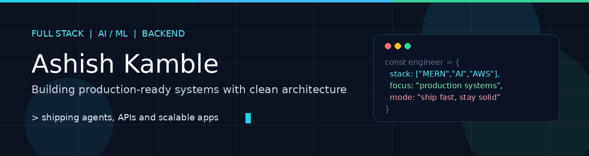
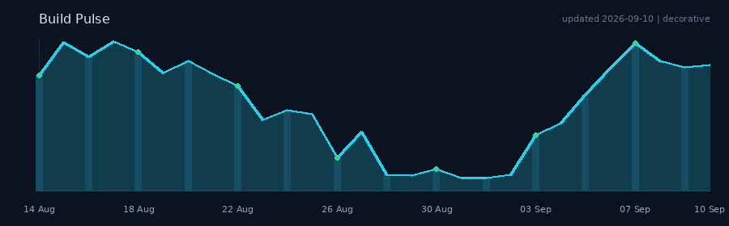

<!-- =========================================================
  GitHub Profile README - Ashish8668
  Repo must stay named Ashish8668 for this to show on your profile
========================================================== -->

  

  
  
  
  
  

  

---

### About

Hey - I'm **Ashish**, a full-stack engineer focused on **AI/ML** and **backend systems**. I design and ship **production-ready** apps - clean APIs, reliable data layers, and agent workflows that hold up in the real world.

- Build end-to-end products across **MERN**, **Java**, and **Python**
- Strong on **backend architecture**, auth, data modeling, and cloud deploy
- Work with **LangChain / LangGraph**, agent stacks, and **Temporal** workflows
- Comfortable from local Docker setups to **AWS** and **Hostinger** deploys

---

### Tech Stack

  
   
  
   
  

  
  
  
  
  
  
  
  
  
  
  
  
  
  
  

---

### Featured Projects

<table>
  <tr>
    <td width="50%" valign="top">
      <h3><a href="https://github.com/Ashish8668/AudiBuddy">AudiBuddy</a></h3>
      

        ML project for <b>voice pathology</b> prediction - detects conditions like
        <b>vocal polyp</b> and <b>laryngitis</b>, with <b>AI explainability</b> so predictions stay interpretable.
      

      

        
        
        
        
      

      
<a href="https://github.com/Ashish8668/AudiBuddy">View repository -&gt;</a>

    </td>
    <td width="50%" valign="top">
      <h3><a href="https://github.com/Ashish8668/SandBox">SandBox</a></h3>
      

        <b>NLP-based resume analysis</b> with job fetching, automatic <b>resume-job matching</b>
        (LinkedIn-aware), match score + suggestions - powered by a <b>Chrome extension</b>.
      

      

        
        
        
        
      

      
<a href="https://github.com/Ashish8668/SandBox">View repository -&gt;</a>

    </td>
  </tr>
</table>

---

### Activity

  

---

### Connect

  
  
  
  

  <i>Building things that ship - and keep shipping.</i>

